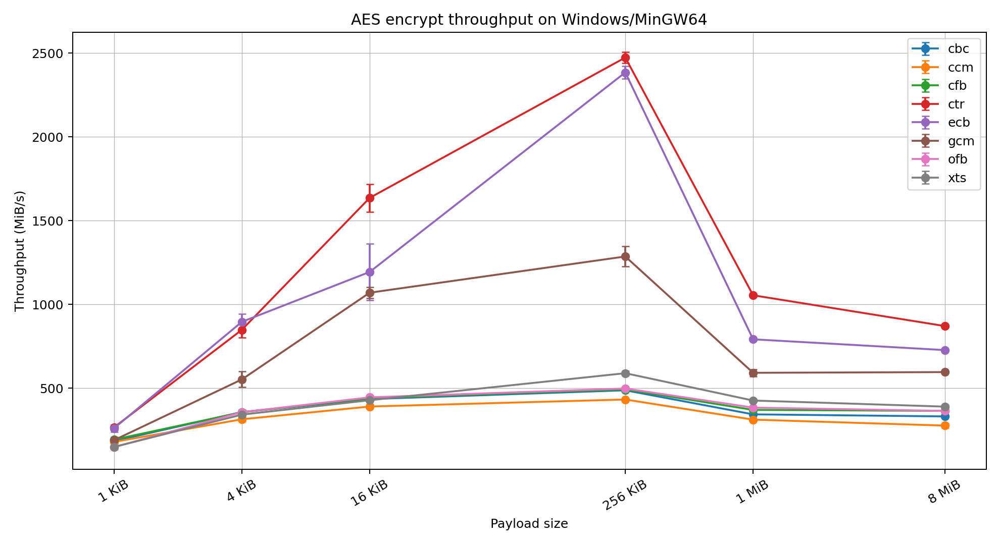
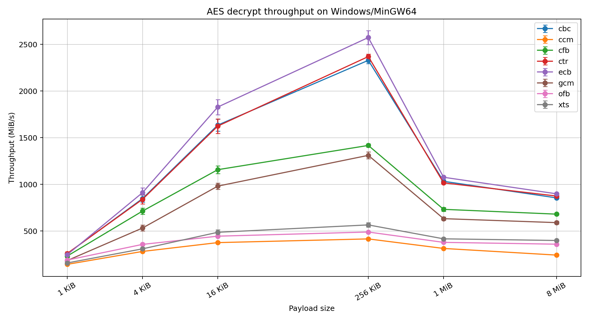
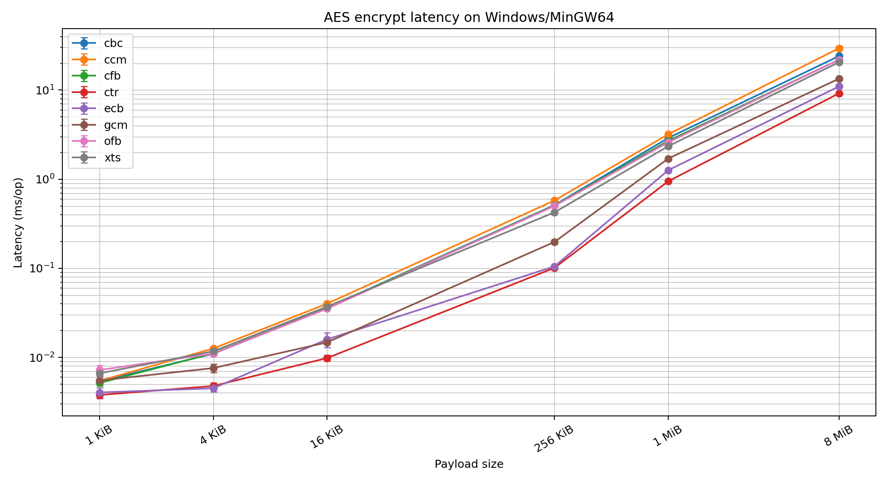
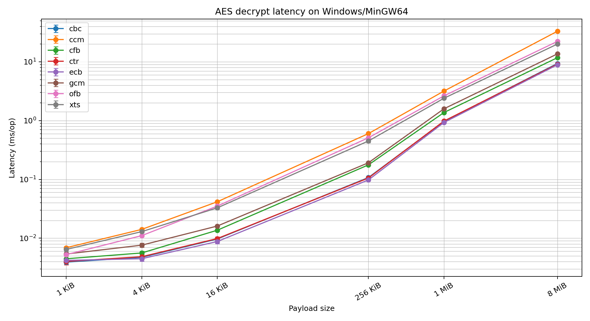

# Lab 1 Report — Symmetric Encryption with Crypto++

## 1. Mục tiêu bài lab

Bài lab này xây dựng công cụ dòng lệnh `aestool` sử dụng thư viện Crypto++ để thực hiện mã hóa đối xứng bằng AES. Công cụ hỗ trợ các chế độ ECB, CBC, CFB, OFB, CTR, XTS, CCM và GCM. Ngoài chức năng mã hóa và giải mã, chương trình còn tích hợp sinh khóa, lưu metadata, kiểm tra Known Answer Test, negative testing, CTest và benchmark.

Mục tiêu chính không chỉ là gọi đúng API mã hóa, mà còn là triển khai một công cụ có tính kỹ thuật hoàn chỉnh. Vì vậy, chương trình phải xử lý dữ liệu nhị phân, hỗ trợ input/output qua file, xác thực tag với các chế độ AEAD, phát hiện một số lỗi sử dụng sai như nonce reuse, đồng thời cung cấp dữ liệu benchmark để đánh giá hiệu năng.

## 2. Môi trường triển khai

| Thành phần | Thông tin |
|---|---|
| Hệ điều hành | Windows 11 25H2 |
| Compiler | MinGW64 g++ |
| Build system | CMake |
| Crypto library | Crypto++ 8.9.0 |
| Crypto++ root | D:/Newfolder/Crypto++ |
| CPU | AMD Ryzen 5 7535HS with Radeon Graphics |
| Cores / threads | 6 cores / 12 threads |
| RAM | 8 GB |
| Storage | Samsung MZVL8512HELU-00BTW SSD |
| Power mode | Performance |

Dự án được build bằng CMake theo mô hình out-of-source build. Cách tổ chức này giúp tách mã nguồn khỏi file sinh ra trong quá trình biên dịch và thuận lợi cho việc kiểm thử đa nền tảng.

## 3. Thiết kế tổng quan công cụ

Công cụ `aestool` được thiết kế theo dạng command-line interface với các nhóm lệnh chính gồm `keygen`, `encrypt`, `decrypt`, `kat` và `bench`. Lệnh `keygen` dùng để sinh khóa. Lệnh `encrypt` và `decrypt` thực hiện mã hóa hoặc giải mã theo mode được chọn tại runtime. Lệnh `kat` chạy Known Answer Test từ file JSON. Lệnh `bench` đo hiệu năng và xuất dữ liệu ra CSV.

Mã nguồn được chia thành nhiều module. Các file xử lý AES-GCM, AES-CCM, AES-XTS và các classic modes được tách riêng. Các thành phần phụ trợ như encoding, file utilities, metadata, nonce registry và benchmark cũng được đặt trong module riêng. Cách chia này giúp chương trình dễ kiểm thử, dễ mở rộng và tránh trộn logic mã hóa với logic nhập xuất hoặc kiểm thử.

## 4. Thiết kế CLI và định dạng dữ liệu

CLI có dạng chung là `aestool <command> [options]`. Khi mã hóa, người dùng chỉ định mode bằng `--mode`, khóa bằng `--key`, dữ liệu đầu vào bằng `--in` hoặc `--text`, và file đầu ra bằng `--out`. Với các chế độ AEAD như GCM và CCM, chương trình hỗ trợ AAD thông qua `--aad-text` hoặc `--aad-file`.

Chương trình xử lý ciphertext dưới dạng raw binary thay vì text. Các tham số phụ như IV, nonce, tweak và tag được lưu trong sidecar metadata JSON. Ví dụ, nếu ciphertext là `ct.bin`, metadata mặc định sẽ là `ct.bin.meta.json`. Cách làm này giữ ciphertext ở dạng nhị phân đúng bản chất, đồng thời vẫn lưu đủ tham số cần thiết để giải mã.

## 5. Triển khai các chế độ AES

Các chế độ ECB, CBC, CFB, OFB và CTR được triển khai trong nhóm classic AES modes. ECB không dùng IV và chỉ được giữ lại vì yêu cầu bài lab. CBC, CFB, OFB và CTR dùng IV 16 byte. CBC và ECB trong luồng CLI thông thường có xử lý padding; CFB, OFB và CTR hoạt động giống stream-like modes nên không cần padding.

GCM và CCM được triển khai như các chế độ AEAD. Khi mã hóa, chương trình tạo ciphertext và authentication tag. Khi giải mã, chương trình xác thực tag trước khi trả plaintext. Nếu ciphertext, AAD hoặc tag bị sửa đổi, quá trình giải mã thất bại và không chấp nhận plaintext.

XTS được triển khai cho ngữ cảnh mã hóa data unit kiểu lưu trữ. XTS dùng key material có độ dài gấp đôi khóa AES thông thường và dùng tweak 16 byte. Tuy nhiên, XTS không cung cấp xác thực dữ liệu nên ciphertext bị sửa đổi có thể tạo ra plaintext sai mà không báo lỗi xác thực.

## 6. Quản lý key, IV, nonce, tweak và metadata

Khóa AES được sinh bằng nguồn ngẫu nhiên an toàn của Crypto++. Chương trình hỗ trợ khóa AES 128, 192 và 256 bit. Riêng XTS hỗ trợ key material 512 bit để tạo hai khóa con 256 bit.

IV, nonce và tweak được tạo tự động nếu người dùng không cung cấp. GCM dùng nonce mặc định 12 byte. CCM dùng nonce hợp lệ theo yêu cầu của mode. CBC, CFB, OFB, CTR và XTS dùng IV hoặc tweak 16 byte. Chương trình kiểm tra độ dài tham số trước khi mã hóa hoặc giải mã để tránh lỗi cấu hình.

Metadata được lưu dưới dạng JSON. Với GCM và CCM, metadata chứa nonce và tag. Với CBC, CFB, OFB và CTR, metadata chứa IV. Với XTS, metadata chứa tweak. Thiết kế này giúp quá trình giải mã tái sử dụng đúng tham số mà không cần nhúng metadata vào ciphertext.

## 7. Cơ chế chống sử dụng sai

ECB được cảnh báo là không an toàn vì các block plaintext giống nhau tạo ra các block ciphertext giống nhau. Công cụ chặn mã hóa file lớn hơn 16 KiB bằng ECB nếu người dùng không chủ động bật `--allow-ecb`.

CTR, GCM và CCM yêu cầu nonce hoặc IV không được lặp lại với cùng khóa. Công cụ sử dụng local nonce registry dựa trên tổ hợp mode, hash của khóa và nonce hoặc IV. Nếu phát hiện reuse, chương trình từ chối mã hóa. Đây là một cơ chế phòng vệ ở tầng công cụ để giảm nguy cơ cấu hình sai.

Với AEAD, chương trình áp dụng fail-closed. Nếu tag không hợp lệ, chương trình báo lỗi và không trả plaintext hợp lệ. Điều này đặc biệt quan trọng vì bỏ qua lỗi xác thực sẽ làm mất ý nghĩa bảo mật của GCM và CCM.

## 8. Known Answer Test

Known Answer Test được dùng để kiểm tra tính đúng đắn của thuật toán bằng cách so sánh output với các vector đã biết. KAT runner đọc test case từ JSON và in kết quả PASS hoặc FAIL cho từng case.

Bộ KAT hiện tại kiểm tra AES-128 ECB, CBC, CFB, OFB, CTR, GCM và CCM. Kết quả trên Windows cho thấy toàn bộ test case đều pass. Log KAT được lưu tại `report/assets/kat_windows.log`.

## 9. Negative Testing

Negative testing kiểm tra khả năng xử lý dữ liệu sai hoặc dữ liệu bị giả mạo. Script Windows kiểm tra sai khóa GCM, sai AAD, ciphertext GCM bị sửa, tag GCM bị sửa, metadata sai, khóa sai độ dài, nonce sai độ dài, nonce reuse, ciphertext CCM bị sửa, IV reuse trong CTR, IV CBC sai độ dài, ECB large-file blocking, XTS input quá ngắn và XTS tampering behavior.

Kết quả negative test được lưu tại `report/assets/negative_tests_windows.log`.

## 10. CTest Integration

CTest được dùng để chạy tự động các test đã cấu hình. Trên Windows, CTest chạy KAT sample và negative test script. Kết quả CTest được lưu tại `report/assets/ctest_windows.log`.

## 11. Phương pháp benchmark

Benchmark được thực hiện bằng lệnh `bench` của `aestool`. Chương trình đo cả mã hóa và giải mã cho ECB, CBC, CFB, OFB, CTR, GCM, CCM và XTS. Các kích thước payload gồm 1 KiB, 4 KiB, 16 KiB, 256 KiB, 1 MiB và 8 MiB. Mỗi cấu hình được chạy 30 lần, mỗi lần gồm 100 phép toán, có warm-up trước khi đo.

Dữ liệu benchmark được xuất thành raw CSV và summary CSV. Summary CSV chứa mean, median, standard deviation và khoảng tin cậy 95% cho latency và throughput. File benchmark summary được lưu tại `report/assets/bench_windows_summary.csv`.

## 12. Kết quả benchmark Windows

Các biểu đồ sau thể hiện throughput và latency trên Windows/MinGW64.

Bảng benchmark rút gọn được tạo từ summary CSV và lưu tại `report/assets/windows_benchmark_tables.md`.

Nhìn chung, các mode không xác thực như CTR, CFB, OFB và CBC có chi phí thấp hơn so với các mode AEAD trong nhiều trường hợp. GCM và CCM có thêm overhead do authentication tag và xử lý xác thực. XTS phù hợp với mã hóa lưu trữ nhưng không cung cấp integrity protection.

## 13. Phân tích bảo mật

ECB không đạt semantic security vì làm lộ mẫu plaintext. Vì vậy, ECB không nên dùng cho dữ liệu thực tế.

CBC an toàn hơn ECB nếu IV được sinh đúng cách, nhưng CBC không xác thực ciphertext. Nếu phản hồi lỗi padding không được xử lý cẩn thận, CBC có thể liên quan đến padding oracle attack.

CTR có tính linh hoạt và hiệu năng tốt, nhưng reuse nonce hoặc IV với cùng khóa là lỗi nghiêm trọng. Nếu reuse xảy ra, attacker có thể khai thác quan hệ XOR giữa các ciphertext.

GCM và CCM cung cấp cả confidentiality và integrity. Tuy nhiên, hai mode này vẫn yêu cầu nonce duy nhất dưới cùng một khóa. Vì vậy, nonce reuse prevention là một lớp bảo vệ cần thiết.

XTS được thiết kế cho mã hóa lưu trữ theo data unit. XTS không xác thực dữ liệu, do đó không nên xem XTS là cơ chế chống chỉnh sửa dữ liệu.

## 14. Giới hạn hiện tại

Phiên bản hiện tại đã hoàn thành build, test và benchmark trên Windows. Phần Linux chưa được thực hiện nên chưa thể kết luận đầy đủ về so sánh đa nền tảng. Bộ KAT hiện tại là representative sample, chưa bao phủ toàn bộ biến thể khóa, nonce, tag và payload. Registry chống nonce reuse là cơ chế cục bộ, không phải cơ sở dữ liệu chống sửa đổi trong môi trường nhiều tiến trình.

## 15. Kết luận

Công cụ `aestool` đã triển khai thành công các chế độ AES yêu cầu trong Lab 1 bằng Crypto++. Chương trình hỗ trợ mã hóa, giải mã, sinh khóa, metadata, AEAD verification, nonce reuse prevention, Known Answer Test, negative testing, CTest và benchmark. Kết quả trên Windows cho thấy chương trình hoạt động đúng với các vector kiểm thử, từ chối các trường hợp lỗi quan trọng và tạo được dữ liệu hiệu năng để phục vụ phân tích.

Giai đoạn tiếp theo là build và benchmark trên Linux để hoàn thiện phần so sánh đa nền tảng, sau đó chuyển báo cáo sang định dạng DOCX nếu cần nộp bản Word.

# Appendix A - Windows Benchmark Tables

# Windows Benchmark Tables

## Coverage

- Total summary rows: 96
- Modes: cbc, ccm, cfb, ctr, ecb, gcm, ofb, xts
- Operations: decrypt, encrypt
- Payload sizes: 1 KiB, 4 KiB, 16 KiB, 256 KiB, 1 MiB, 8 MiB

Coverage check: PASS. Expected 96 rows and got 96 rows.

### Windows encrypt benchmark at 1 KiB

| Mode | Mean throughput (MiB/s) | 95% CI throughput | Mean latency (ms/op) | 95% CI latency |
|---|---:|---:|---:|---:|
| ctr | 266.72 | ±14.21 | 0.003787 | ±0.000320 |
| ecb | 261.67 | ±21.17 | 0.004041 | ±0.000525 |
| cfb | 193.83 | ±8.55 | 0.005159 | ±0.000364 |
| gcm | 190.50 | ±17.84 | 0.005512 | ±0.000560 |
| cbc | 185.30 | ±8.61 | 0.005400 | ±0.000377 |
| ccm | 180.22 | ±4.96 | 0.005455 | ±0.000173 |
| xts | 150.08 | ±7.22 | 0.006629 | ±0.000341 |
| ofb | 148.81 | ±14.17 | 0.007221 | ±0.000961 |

### Windows decrypt benchmark at 1 KiB

| Mode | Mean throughput (MiB/s) | 95% CI throughput | Mean latency (ms/op) | 95% CI latency |
|---|---:|---:|---:|---:|
| ctr | 260.07 | ±19.06 | 0.004023 | ±0.000492 |
| cbc | 257.26 | ±13.53 | 0.003921 | ±0.000320 |
| ecb | 246.79 | ±20.57 | 0.004199 | ±0.000388 |
| cfb | 232.21 | ±17.23 | 0.004466 | ±0.000484 |
| ofb | 189.23 | ±7.55 | 0.005250 | ±0.000300 |
| gcm | 184.24 | ±6.60 | 0.005375 | ±0.000275 |
| xts | 158.40 | ±10.24 | 0.006429 | ±0.000558 |
| ccm | 143.58 | ±4.43 | 0.006880 | ±0.000341 |

### Windows encrypt benchmark at 16 KiB

| Mode | Mean throughput (MiB/s) | 95% CI throughput | Mean latency (ms/op) | 95% CI latency |
|---|---:|---:|---:|---:|
| ctr | 1636.00 | ±82.84 | 0.009827 | ±0.000729 |
| ecb | 1194.12 | ±168.80 | 0.015949 | ±0.002965 |
| gcm | 1070.28 | ±34.24 | 0.014737 | ±0.000578 |
| ofb | 446.00 | ±9.66 | 0.035181 | ±0.000907 |
| cfb | 441.09 | ±13.18 | 0.035696 | ±0.001222 |
| cbc | 435.61 | ±8.84 | 0.035986 | ±0.000767 |
| xts | 428.81 | ±23.08 | 0.037189 | ±0.001864 |
| ccm | 391.20 | ±8.11 | 0.040077 | ±0.000874 |

### Windows decrypt benchmark at 16 KiB

| Mode | Mean throughput (MiB/s) | 95% CI throughput | Mean latency (ms/op) | 95% CI latency |
|---|---:|---:|---:|---:|
| ecb | 1828.12 | ±81.18 | 0.008778 | ±0.000710 |
| cbc | 1634.81 | ±63.65 | 0.009690 | ±0.000451 |
| ctr | 1624.06 | ±78.75 | 0.009854 | ±0.000645 |
| cfb | 1157.45 | ±42.28 | 0.013658 | ±0.000575 |
| gcm | 981.27 | ±34.01 | 0.016089 | ±0.000639 |
| xts | 486.95 | ±27.04 | 0.032801 | ±0.001720 |
| ofb | 445.35 | ±6.90 | 0.035149 | ±0.000556 |
| ccm | 376.51 | ±7.50 | 0.041636 | ±0.000904 |

### Windows encrypt benchmark at 1 MiB

| Mode | Mean throughput (MiB/s) | 95% CI throughput | Mean latency (ms/op) | 95% CI latency |
|---|---:|---:|---:|---:|
| ctr | 1054.99 | ±7.52 | 0.948243 | ±0.006747 |
| ecb | 792.29 | ±3.52 | 1.262357 | ±0.005613 |
| gcm | 592.47 | ±20.68 | 1.705719 | ±0.068735 |
| xts | 426.96 | ±6.97 | 2.346985 | ±0.039326 |
| ofb | 384.73 | ±1.04 | 2.599335 | ±0.006972 |
| cfb | 371.07 | ±5.32 | 2.699424 | ±0.041476 |
| cbc | 344.49 | ±2.01 | 2.903584 | ±0.016889 |
| ccm | 313.11 | ±3.02 | 3.196323 | ±0.034496 |

### Windows decrypt benchmark at 1 MiB

| Mode | Mean throughput (MiB/s) | 95% CI throughput | Mean latency (ms/op) | 95% CI latency |
|---|---:|---:|---:|---:|
| ecb | 1076.31 | ±6.58 | 0.929364 | ±0.005696 |
| cbc | 1033.04 | ±16.25 | 0.969911 | ±0.016078 |
| ctr | 1016.38 | ±3.63 | 0.983982 | ±0.003509 |
| cfb | 732.78 | ±20.96 | 1.373525 | ±0.041239 |
| gcm | 632.94 | ±17.90 | 1.590437 | ±0.049363 |
| xts | 416.99 | ±6.06 | 2.402007 | ±0.035280 |
| ofb | 379.08 | ±1.47 | 2.638238 | ±0.010201 |
| ccm | 314.05 | ±1.59 | 3.184812 | ±0.016708 |

### Windows encrypt benchmark at 8 MiB

| Mode | Mean throughput (MiB/s) | 95% CI throughput | Mean latency (ms/op) | 95% CI latency |
|---|---:|---:|---:|---:|
| ctr | 871.30 | ±6.06 | 9.185119 | ±0.064718 |
| ecb | 727.95 | ±2.89 | 10.991121 | ±0.043752 |
| gcm | 596.63 | ±5.36 | 13.416894 | ±0.121313 |
| xts | 390.68 | ±8.78 | 20.562041 | ±0.499975 |
| ofb | 365.27 | ±1.65 | 21.905031 | ±0.098910 |
| cfb | 365.23 | ±4.47 | 21.929856 | ±0.281645 |
| cbc | 332.29 | ±1.37 | 24.078702 | ±0.098129 |
| ccm | 277.47 | ±14.02 | 29.487697 | ±1.724889 |

### Windows decrypt benchmark at 8 MiB

| Mode | Mean throughput (MiB/s) | 95% CI throughput | Mean latency (ms/op) | 95% CI latency |
|---|---:|---:|---:|---:|
| ecb | 899.03 | ±6.75 | 8.902465 | ±0.070191 |
| ctr | 875.29 | ±5.93 | 9.142963 | ±0.061278 |
| cbc | 855.57 | ±6.37 | 9.354398 | ±0.069119 |
| cfb | 681.32 | ±7.80 | 11.754139 | ±0.142174 |
| gcm | 590.55 | ±15.49 | 13.628785 | ±0.414977 |
| xts | 399.31 | ±4.09 | 20.051587 | ±0.217964 |
| ofb | 359.67 | ±1.63 | 22.245819 | ±0.099986 |
| ccm | 242.85 | ±5.87 | 33.095412 | ±0.837318 |
